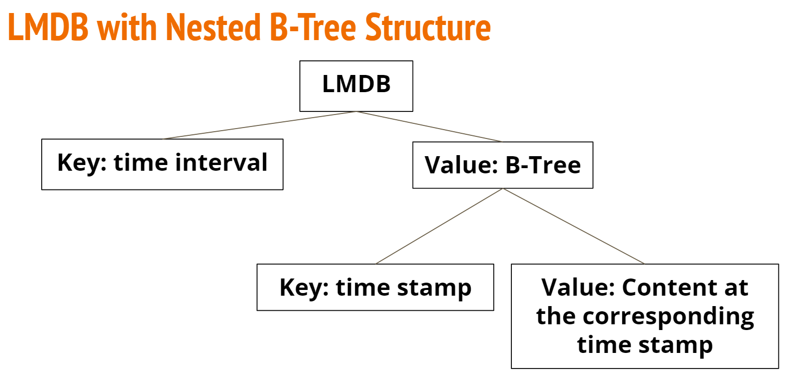
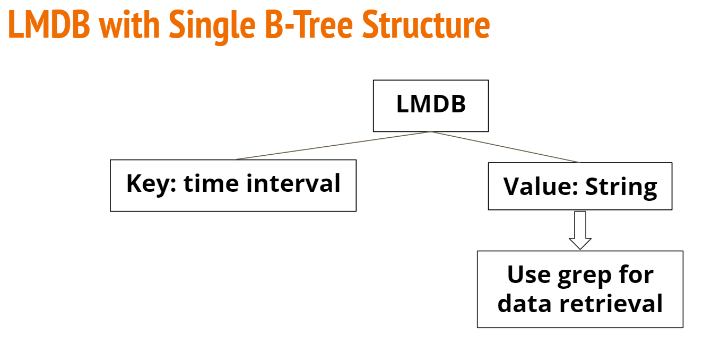

# CSCI 2270 Group Project

### Dtabase, Spring 2022

## Group
Zijian Chen, Yongxuan Fu, Wei Li, Zhuo Wang, Zi Yang

## Introduction
- We use the log data from the thuderbird as a example, the goal for this project is try to find a better data structure that can improve the search performance.

- We design 2 data structures to test the search performance
  1. The first one is LMDB with Nested B-Tree Structure
    
  2. The second one is LMDB with single B-Tree Structure
    
## Technical Features

### 1. Data Preprocessing
In the `log2json` directory, the `read_log.py` is used for transforming a big log file into many JSON files. Each JSON file has default `1000` logs. However, the user can use file_size to define how many logs are in each JSON file. The variable log_file is what log file we want to use. The variable json_directory is which directory we want to store JSON files in.
``` Python
    log_file = "./thunder_bird.log"
    json_directory = "./json_directory"
    file_size = 1000
    transform_2_json(log_file,json_directory,file_size)
```

### 2. Store and Search Data
We use rust [lmdb package](https://docs.rs/lmdb/latest/lmdb/index.html) to store our data
#### Store data
- In `src` directory, `main.rs` file, `main()` function, comment the `open_db()` function, comment out the `create_db()` function.
``` Rust
    fn main() {
        create_db();
        //open_db();  
    }
```
- In the `create_db()` function, There are several places you can modify to apply for your own test:
  1. Change the map size to set the maximum size of data you can store.
  ``` Rust
    let map_size:libc::size_t =  42949672960;
    EnvironmentBuilder::set_map_size(& mut env_builder, map_size);
  ```
  2. Change the path name to match the path you want to create your environemnt.
  ``` Rust
    let path = Path::new("../env2/env_string_big");
  ```
  3. Switch between two data structure store function we use, the first one is lmdb with nested btree, the second one is lmdb with single btree.
  ``` Rust
    //btree_map_test::store_with_btreeMap(trans, db);
    grep_test::store_with_string(trans, db);
  ```
- In the `store_with_btreeMap()` or `store_with_string()` function, There are several places you can modify to apply for your own test:
  1. Change the time range.
  ``` Rust
    let time_range = 100;
  ```
  2. Change the for loop times to match how many json files you have when do the datapreprocessing.
  ``` Rust
    for i in 0..3521{ //since we have file from 0 to 3520
  ```
  3. Change the path to match where you put your josn data.
  ``` Rust
    let d_name = format!("C:/Users/14767/master-term2/csci2270/project/log2json/json_directory/file_{}.json", i );
  ```
After modify all of this parts, you can run your code to store the data, one thing need to mention is that if you try to store large data like 35GB, it will take about half hour to finish, so once you store the data, remember to change the path when you want to store new data.
#### Search data
- In `src` directory, `main.rs` file, `main()` function, comment the `create_db()` function, comment out the `open_db()` function.
``` Rust
    fn main() {
        //create_db();
        open_db();  
    }
```
- In the `open_db()` function, There are several places you can modify to apply for your own test:
  1. Change the map size to set the maximum size of data you can store.
  ``` Rust
    let map_size:libc::size_t =  42949672960;
    EnvironmentBuilder::set_map_size(& mut env_builder, map_size);
  ```
  2. Change the path name to match the path you want to open your environemnt.
  ``` Rust
    let path = Path::new("../env2/env_string_big");
  ```
  3. Switch between two data structure search function we use, the first one is lmdb with nested btree, the second one is lmdb with single btree.
  ``` Rust
    //btree_map_test::search_with_btreeMap(cursor);
    grep_test::search_with_string(cursor);
  ```
- In the `search_with_btreeMap()` or `search_with_string()` function, There are several places you can modify to apply for your own test:
  1. Change the key you want to search.
  ``` Rust
      let mut key:u64 = 1134528001;
  ```
  2. In the `search_with_btreeMap()` function:
    If you want to search for a time range, when you get the variable `v`, which is a `btreeMap` structure in rust, it is the result. 
    But if you want to search for a single timestamp, just use get function to get the one you want.
    ``` Rust
        match v.get(&key) {
    ```
  3. In the `search_with_string()` function:
    If you want to search for the whole time range in one key, when you get the variable `v`, which is a `string` structure in rust, it is the result.
    But if you want to search for a single timestamp you need to call the `grep_function` 
    ``` Rust
        if let Err(_e) = grep_function(v.as_bytes(), &key.to_string()) { /* */ }
    ```
-   The grep function we use is referenceing the rust package [grep-searcher](https://docs.rs/grep-searcher/latest/grep_searcher/)
### 3. Use Lucene to compare the result
In the `LuceneTest` directory, there is another readme to explain how to use it.